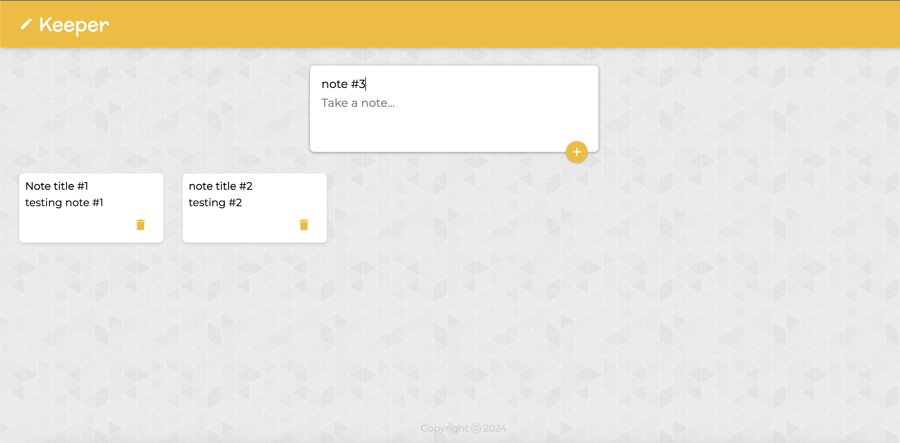

# Note Keeper App
A web application using MERN stack that provide functionalities such as writing a note and saving it to Mongo DB, display existing Notes and delete a note.




## How To Run
Create the file `/server/.env` with your Atlas URI and the server port:
```
ATLAS_URI=mongodb+srv://<username>:<password>@sandbox.jadwj.mongodb.net/
PORT=5000
```

Start server:
```
cd /server
npm install
nodemon index.js
```

Start Web server
```
cd /client
npm install
npm start
```
